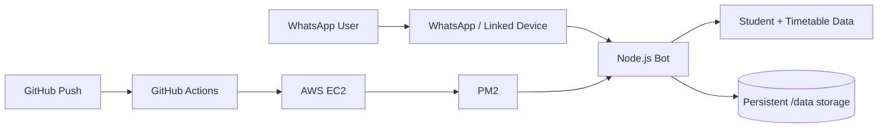

<div align="center">

# 💬 SLIIT WhatsApp Bot — AWS Edition

### Cloud-hosted student assistant with WhatsApp, Node.js, PM2 and automated EC2 deployment


[](https://github.com/teldigi5-wq/WHATSAPPbotAWS/actions/workflows/ci.yml)

**A deployment-focused WhatsApp automation project built to run continuously on AWS EC2.**

</div>

---

## 🎯 Project goal

This repository packages a WhatsApp student-assistant bot for reliable cloud deployment rather than local-only execution.

The project focuses on the engineering around the bot itself: **process supervision, persistent session data, EC2 setup, restart behavior and automated deployment from GitHub**.

---

## 🏗️ Architecture



```text
GitHub repository
      ↓
GitHub Actions deployment
      ↓
AWS EC2
      ↓
PM2 process manager
      ↓
Node.js WhatsApp bot
      ↓
Persistent session/data storage
```

---

## ⚡ Engineering highlights

- AWS EC2 deployment workflow
- PM2 process supervision and reboot persistence
- GitHub Actions deployment automation
- Persistent WhatsApp session storage outside the source tree
- Student and timetable data integration
- Browser-accessible QR linking flow
- Separation between application code and server-specific deployment configuration
- `.gitignore`-based protection for local/runtime data

---

## 📁 Repository structure

```text
whatsapp-bot/
├── bot.js
├── students.json
├── timetable.json
├── package.json
├── ecosystem.config.js
├── setup.sh
├── .gitignore
└── .github/
    └── workflows/
        ├── ci.yml
        └── deploy.yml
```

| File | Purpose |
|---|---|
| `bot.js` | Main WhatsApp bot runtime |
| `students.json` | Student information used by the bot |
| `timetable.json` | Timetable data source |
| `ecosystem.config.js` | PM2 application configuration |
| `setup.sh` | EC2 bootstrap/setup script |
| `.github/workflows/ci.yml` | Automated repository validation |
| `.github/workflows/deploy.yml` | Deployment automation |

---

## ✅ Automated validation

The repository includes a GitHub Actions CI workflow that runs on pushes and pull requests to `main`.

It verifies:

- clean dependency installation with `npm ci`
- JavaScript syntax for the bot and PM2 configuration
- JSON validity for student and timetable data
- shell syntax for the EC2 setup script
- presence of required runtime and deployment files

This keeps code validation separate from production deployment so changes can be checked before they reach an EC2 environment.

---

## 🚀 Deployment

### 1. Prepare the EC2 instance

Recommended baseline:

- Amazon Linux 2023
- `t3.micro` or larger depending on workload
- SSH access restricted to your own trusted IP where possible
- Application port opened only when required

### 2. Clone the repository

```bash
git clone https://github.com/teldigi5-wq/WHATSAPPbotAWS.git
cd WHATSAPPbotAWS
```

### 3. Run the setup script

```bash
chmod +x setup.sh
./setup.sh
```

### 4. Enable PM2 startup persistence

```bash
pm2 startup
pm2 save
```

Follow the command printed by `pm2 startup` when required.

### 5. Link WhatsApp

Open the configured bot web endpoint in a browser and scan the generated QR code using:

**WhatsApp → Linked Devices → Link a Device**

---

## 🔁 Continuous deployment

The repository includes a GitHub Actions workflow for deployment after updates to the main branch.

Required repository secrets depend on the workflow configuration and may include values such as:

| Secret | Purpose |
|---|---|
| `EC2_HOST` | Target EC2 host/IP |
| `EC2_KEY` | SSH private key used by the deployment workflow |

> Never commit SSH keys, WhatsApp authentication data, tokens or other secrets to the repository.

---

## 🧰 PM2 operations

```bash
pm2 status
pm2 logs whatsapp-bot
pm2 restart whatsapp-bot
pm2 stop whatsapp-bot
```

PM2 keeps the Node.js process supervised and can restore the application after a server reboot when startup persistence is configured correctly.

---

## 💾 Persistent data

Runtime state is designed to live outside the normal deployment source directory.

```text
/data
```

This prevents a normal code deployment from wiping the linked-device session or other runtime data.

**Do not publish or commit authentication/session files.** Treat WhatsApp session data like a credential.

---

## 🧠 What this project demonstrates

From an engineering portfolio perspective, this project is less about a single chat command and more about operating a small service reliably:

- deploying Node.js applications to Linux servers
- managing long-running processes
- handling persistent runtime state
- separating secrets from source code
- automating deployments
- validating changes in CI before deployment
- debugging server-side application lifecycle issues

These are the same foundations used in larger backend and platform systems.

---

## 🔭 Possible next improvements

- containerized deployment
- structured logging
- health-check endpoint
- automated smoke tests after deployment
- environment validation on startup
- deployment rollback strategy
- metrics and uptime monitoring

---

<div align="center">

### Build locally. Validate automatically. Operate reliably in the cloud.

**Poojana Kaveesh Sellahewa**

</div>
